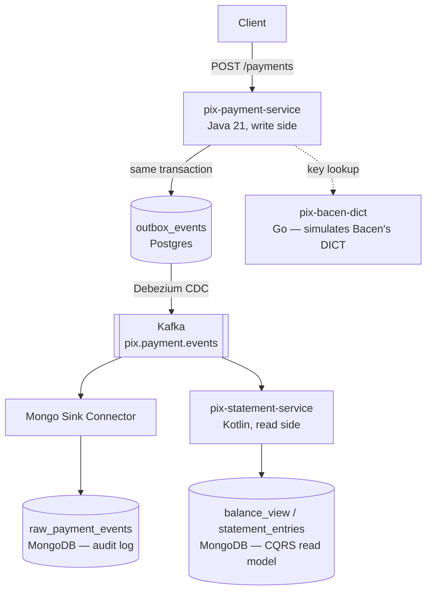

# SimplePix

A hands-on study project simulating a Pix-like instant payment system — built to deepen practical knowledge of event-driven architecture, CQRS, Domain-Driven Design, and polyglot microservices ahead of technical interviews.

This is **not** a production system. It's a deliberately over-instrumented sandbox: every architectural piece here was added to be *understood deeply*, not because the problem size demanded it. See [Design Decisions](#design-decisions) for an honest discussion of when each pattern actually pays for itself.

## Status

| Service | Language | Status |
|---|---|---|
| `pix-payment-service` | Java 21 / Spring Boot 4 | Functional — write side, REST API, outbox pattern |
| `pix-statement-service` | Kotlin / Spring Boot 4 | Planned — read side, Kafka consumer, CQRS projection |
| `pix-bacen-dict` | Go | Functional — simulates the Central Bank's key directory (DICT) |
| Kafka Connect (Debezium + Mongo Sink) | — | Functional — CDC pipeline running |

No automated tests yet — a known, acknowledged gap, next on the list after the read side is in place.

## Architecture



Each arrow represents a real architectural decision, not a default — see below for the reasoning behind each one.

## Services

### `pix-payment-service` (Java 21, Spring Boot 4)

The write side. Owns account balances, payment lifecycle, and Pix key registration for its own institution.

- **Hexagonal architecture**: domain has zero framework dependencies; adapters (web, persistence, messaging) depend inward, never the reverse.
- **Rich domain model**: `Account` and `Payment` are mutable aggregates enforcing their own invariants (`debit()` validates balance; `PaymentStatus` encodes its own legal state transitions). `Money` and `PixKey` are immutable value objects (Java `record`s) validating themselves at construction.
- **Sealed types** for domain events and exceptions — the compiler enforces exhaustive handling everywhere they're consumed.
- **Concurrency control**: pessimistic locking (`SELECT ... FOR UPDATE`) on the debit path to avoid retry storms under contention; optimistic locking (`@Version`) as a safety net elsewhere.
- **Transactional outbox**: the payment and its outbound event are written in the same Postgres transaction — no dual-write, no risk of losing an event if the process crashes between writing to the DB and publishing to Kafka.

### `pix-statement-service` (Kotlin, Spring Boot 4) — planned

The read side. Consumes `pix.payment.events`, materializes a CQRS read model (`balance_view`, `statement_entries`) into MongoDB, and serves query endpoints.

Deliberately written in Kotlin rather than Java: this project's language choice per service mirrors how real engineering orgs often operate — Java where robustness and explicit typing matter most, Kotlin where conciseness and null-safety pay off on new development. It's the same reasoning [iFood's own engineering blog](https://institucional.ifood.com.br/inovacao/desenvolvimento-de-software-logistica-ifood/) describes for their own stack.

### `pix-bacen-dict` (Go)

A minimal simulation of the Central Bank's **DICT** (Diretório de Identificadores de Contas Transacionais) — the real-world service that maps a Pix key to the financial institution that owns it.

- Standard library only (`net/http`, Go 1.22+ pattern-based routing) — no framework, to demonstrate idiomatic Go without leaning on scaffolding.
- SQLite via `modernc.org/sqlite` (pure Go, no CGO) — keeps the Docker image statically linked and small (~15MB final image).
- `crypto/rand` (not `math/rand`) for random key generation — Pix's "EVP" random key is effectively a bearer identifier for a bank account; using a non-cryptographic PRNG for that would be a real security smell, even in a study project.
- Three endpoints: register, look up, and delete a key. Portability/claim flows (what happens when a key is contested between institutions) are intentionally out of scope — real complexity there is weeks of work for a detail that doesn't change the learning goal.

## Design decisions

Short version of the reasoning behind each non-obvious choice — happy to go deeper on any of these live.

**Why outbox instead of publishing to Kafka directly from the service?**
Writing to Postgres and to Kafka are two separate operations with no shared transaction. If the process dies between them, or Kafka is briefly unreachable, the payment is saved but the event is silently lost. Outbox writes the event to a table in the *same* transaction as the business data — an event only exists if the payment does.

**Why Debezium/CDC instead of a polling scheduler reading the outbox table?**
CDC reads the Postgres WAL directly — no repeated polling load, lower latency. Trade-off: it requires running and operating Kafka Connect, which is a real operational cost. Polling is simpler to run but slower and heavier on the database. Neither is "correct" in the abstract — it depends on whether you already need Connect for something else.

**Why two databases (Postgres + MongoDB)?**
Not "SQL vs NoSQL" as a philosophy — it's about the access pattern and guarantee each side needs. The write side needs ACID transactions across multiple rows (debit one account, credit another) and strong constraints (balance can't go negative, idempotency keys are unique at the database level, not just in application code). The read side needs single-document reads by key, shaped for the exact query the UI makes — no joins, no multi-row transactions.

**Would this architecture make sense for a low-traffic system?**
No — and that's deliberate. For most Pix-scale traffic, a single well-indexed Postgres instance resolves the majority of scenarios. The escalation path, in order, is: single database → read replicas → CQRS with a separate read store → event-driven decoupling via Kafka/CDC. This project intentionally builds the *last* step to study it in depth; it is not the answer this author would give first for a low-volume system.

**Why a separate Go service for the DICT instead of a table in the payment service?**
The real Bacen DICT is infrastructure outside any single institution's control — a genuinely separate bounded context, owned by no participant bank. Modeling it as a separate service (and in a different language) reflects that boundary honestly, and gives the `pix-payment-service`'s hexagonal `PixKeyRepository` port a second real implementation (local Postgres lookup vs. HTTP call to an external directory) without touching a single line of domain code.

## Running locally

```bash
docker compose up -d --build
```

Brings up Postgres (logical replication enabled for Debezium), MongoDB, Kafka (KRaft mode), Kafka UI, Kafka Connect (Debezium Postgres connector + MongoDB sink), and the DICT service.

Register the CDC pipeline:

```bash
curl -X POST -H "Content-Type: application/json" \
  --data @kafka-connect/connectors/pix-payment-outbox-source.json \
  localhost:8083/connectors

curl -X POST -H "Content-Type: application/json" \
  --data @kafka-connect/connectors/pix-payment-events-mongo-sink.json \
  localhost:8083/connectors
```

Run the payment service:

```bash
cd pix-payment-service
./gradlew bootRun
```

Run the DICT service (or use the container started by compose):

```bash
cd pix-bacen-dict
go run ./cmd/dict
```

## Roadmap

- [ ] `pix-statement-service` — Kafka consumer, MongoDB read model, idempotent event projection
- [ ] `DictHttpAdapter` — wire `pix-payment-service` to call `pix-bacen-dict` over HTTP as a second `PixKeyRepository` implementation, with timeout + circuit breaker
- [ ] Unit and integration tests (Testcontainers) across all services
- [ ] Retry + dead-letter topic handling in the statement service consumer
- [ ] Multi-bank simulation: a second payment-service instance plus an orchestrating `spi-simulator`, implementing a real saga (reserve → confirm/compensate) instead of a single local transaction

## License

MIT — see [LICENSE](./LICENSE).
